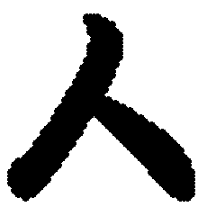
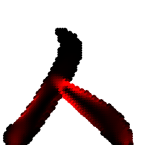
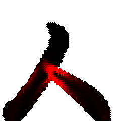
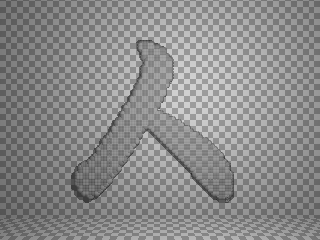
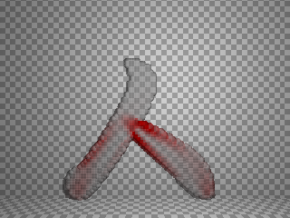
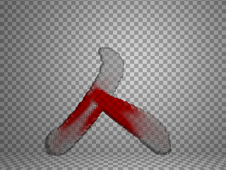
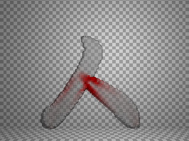

# 人と人が支え合った時のストレス

## 概要

どこかのテレビ番組で「『人』という字は人と人が支え合ってできている」的なことを言ってたらしいので、
実際に支え合ったらどちらにどのくらいのストレス(応力)がかかっているかを計算してみるコード。

## 使い方

    $ make
    $ ./a.out <hito.data

実行するとbitmapを吐きます。
povファイルも吐いているので、もしpovrayを持っていたら、make pngでレンダリングもできます。

    $ make png

## 実行結果

### ファイル

### アニメーションGIF

## ライセンス

MIT